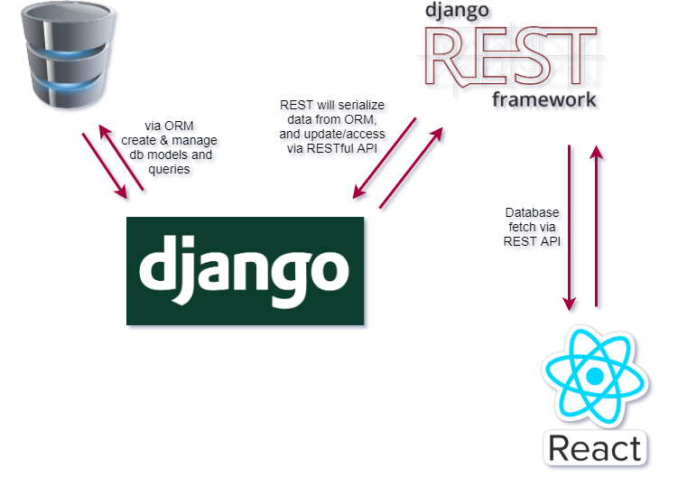

# Graduation Project Outline

At the end of this course, our students will build a complete full-stack *blog site* project. Every student will finish his/her blog site as a graduation project. 

- During this graduation project, We will use the Agile Methodology.

- Students will finish the project in a two-week sprint. During the project sprint, in-class sessions will be used as office hours and will only last 90 minutes. For the first week of the sprint, back-end instructor @Henry will answer your back-end related questions, and for the next week, @John will answer your front-end associated questions.

- You will use Django for the back-end framework to provide REST endpoints.

- You will use ReactJS for the front-end library.

- Every student will use their own GitHub account as the repository base.

- You are to publish one repository for the back-end and one for the front-end. You are to deploy both back-end and front-end parts on Heroku servers using your free tier account.

- Every mentoring group will use a Jira cloud project workspace to facilitate project management features in the Jira. Your mentors will be your scrum masters and product owners at the same time.

- We will provide you the minimum required tasks list to finish the project, but polishing details are yours.

- You are expected to complete the tasks/tickets in the Jira cloud and follow the project management procedures. For example, take a ticket from sprint backlog to *"in progress"* and then as you push your commit to the Github repository, update the status of the ticket to *" in review"*.

- You are expected to work on the task number/feature branch and push that branch to your public Github repositories and make a Pull Request for yourself to merge to the main/master branch. Please mention your mentor's Github account name in the Pull Request to notify him of the progress you've just made.

- Daily stand up meetings will be held virtually on your group slack channel, answering these three questions below:
  - What did you do yesterday?
  - What will you do today?
  - What (if anything) is blocking your progress?

- In the end, there will be a presentation session for outstanding voluntary student projects and an overview of the whole project by the instructors.

- Do not hesitate to ask for help from your colleagues and your mentors. However, it is highly encouraged to study the project by yourself. Please assume this project as your graduation thesis.

  ​      Good luck! May the force be with you!